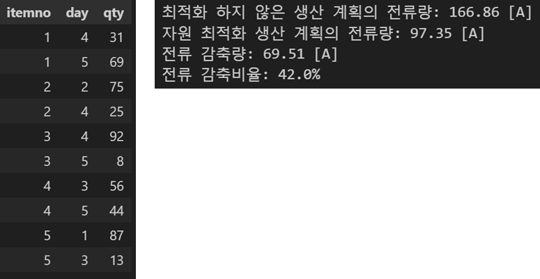
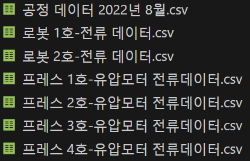
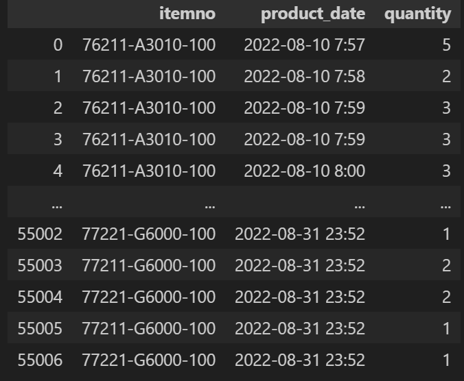
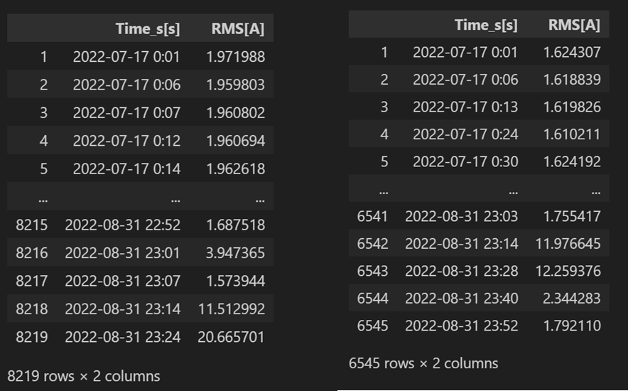
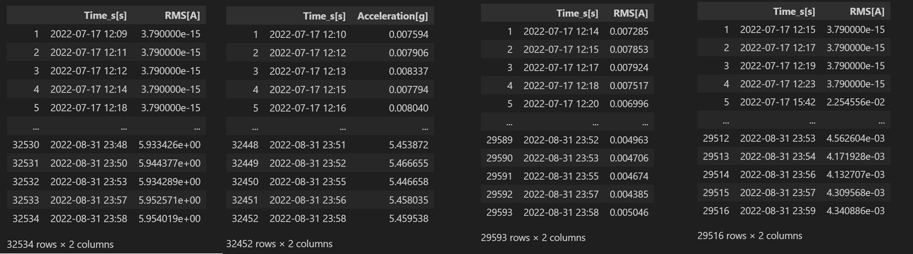
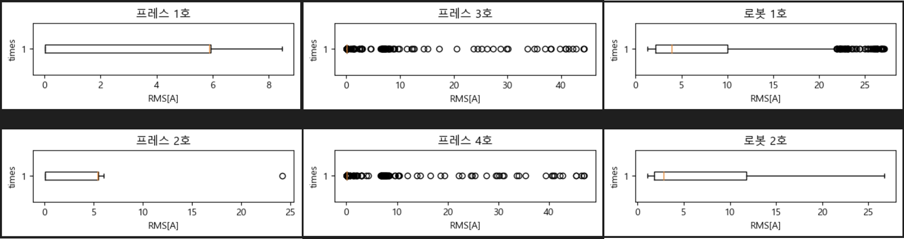
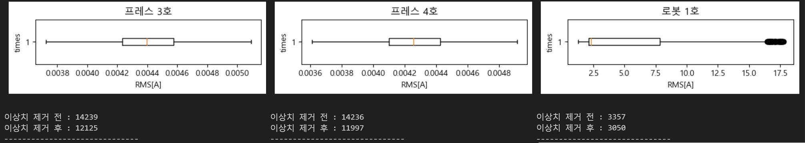
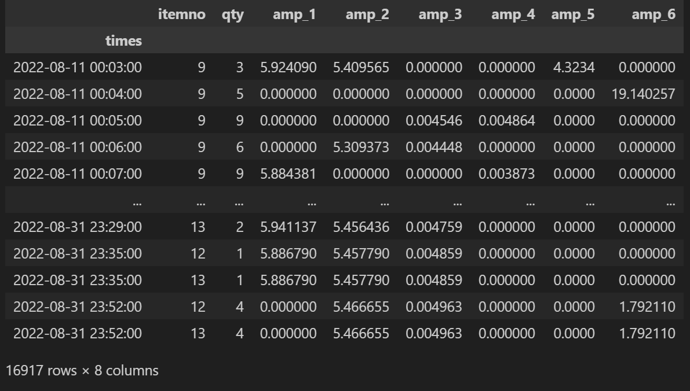
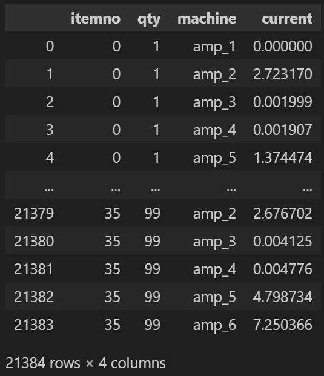
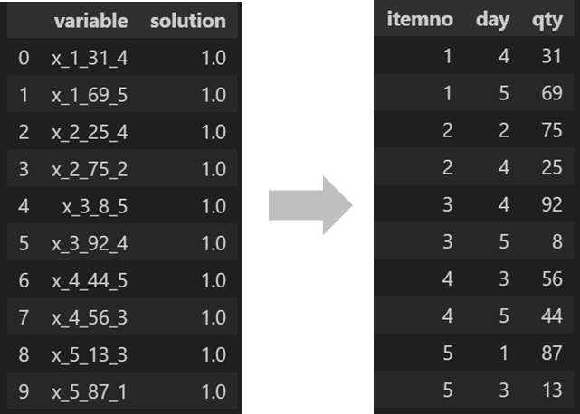

# 자원최적화 프로젝트
> **가상환경 구성**
> 1. conda create -n py3.8_chap_plastic_working_resource_optimization python=3.8.8
> 2. conda activate py3.8_chap_plastic_working_resource_optimization  
>
> **패키지**
> 1. pip install jupyter
> 2. pip install pandas==1.4.4 numpy==1.19.5 matplotlib==3.4.3 mip==1.12.0 pycaret==2.3.0
## 프로젝트 설명

**위와 같은 업무가 주어졌을 때 어떤 기준으로 생산계획을 수립하면 좋을까?**
1. "하루에 100개씩 1~5번품목 생산하죠!" 라고 한뒤 생산계획서를 작성한다.
2. "최소한의 비용으로 제품을 생산하겠습니다!" 라고 한뒤 최소 생산비용 모델을 생성하여 생산계획서를 수립한다.   

**2번**을 선택했다면, 아래의 비용 최적화 프로젝트를 진행하여 42% 전류를 감축할 수 있습니다.


## 프로젝트 요약 

### 데이터 확인
  
<br>
<br>


#### 공정 데이터 2022년 8월 : 8월 10일~ 8월 31일까지의 제품 생산데이터


- 최적화에 필요하지 않은 기존 'idx', 'lineno', 'Order_date', 'cnt', 'day_night_type' 컬럼은 제외

#### 로봇 1,2호 및 프레스 1\~4호 데이터 
- 측정된 시간대가 제각각이므로 전처리 필요.
  
△로봇 1, 2호  


△프레스 1\~4호

  
 

 ## 데이터 이상치 제거 및 병합
 
 - 프레스 3,4호 및 로봇 1호 설비에 이상치 多확인
 - 이상치 제거함수 생성, 이상치 제거

 ```python
 def remove_outlier(df, n):
    # 이상치 제거 반복 횟수
    for i in range(n):
        target = df.iloc[:,1]

        Q1 = df.iloc[:,1].quantile(0.25)
        Q3 = df.iloc[:,1].quantile(0.75)
        IQR = Q3 - Q1

        under = Q1 - (1.5*IQR)
        upper = Q3 + (1.5*IQR)

        df = df[(target >= under) & (target <= upper)]
    
    return df
 ```
 - 이상치 제거 후

 

- 이상치 처리 후 데이터 병합
    - 공통 데이터인 8월 11일~31일까지의 데이터만 추출
    - 1분단위의 데이터로 datetime 통일

 

△**itemno : 품목 번호 / qty : 생산량 / amp_1~6 : 각 설비의 전류 값**

## 모델 생성 및 적용
- pycaret라이브러리 활용. autoML진행.
```python
# 각각 저장됨
amp_list = ['amp_2', 'amp_3', 'amp_4', 'amp_5', 'amp_6']

for amp in amp_list:
    reg1 = setup(
        df[['itemno', 'qty', amp]],
        target=amp, # 타겟 : 전류값
        categorical_features=['itemno'],
        numeric_features=['qty'],
        session_id=123,
        experiment_name=f'{amp}_best_model',
        normalize = True, # 데이터 normalize
        silent=True
    )
    
    best_model = compare_models(include=['lr', 'rf', 'ada'], sort='MAE')
    
    tuned_best_model = tune_model(best_model)
    
    # 각각의 amp에 대한 모델을 저장
    save_model(tuned_best_model, model_name=f'./model/{amp}_best_model')
```
- 생성된 모델 적용, 품목별 생산량에 대한 설비의 전류값 DataFrame생성
 


- 품목별, 생산량, 설비별 전류 소모값 dictionary 생성
```python
# ciqm : item, qty별 machine의 소비전력 예측값

ciqm = {} # 특정 itemno (i), 생산하는 qty (q), 생산 machine (m)에 대한 current dictionary
for index, info in guide_info_df.iterrows():
    ciqm[info['itemno'], info['qty'], info['machine']] = info['current']
```

- Mixed-Integer Programming(MIP)패키지 활용, 이진 분류기 생성
```python
# xiqt : 이진분류 optimization를 시킨 모델의 소비전력 예측값 
# 각각의 i(품목), q(생산량), t(일자:1~5)에 대하여 이진분류를 수행하는 모델(mip.Model)생성

model = mip.Model("optimization")
xiqt = {
    (i, q, t): model.add_var(var_type=mip.BINARY, name=f"x_{i}_{str(q)}_{str(t)}" )
    for i in I for q in Q for t in T
}
xiqt
```

- 목적함수 설정(mip.minimize())
```python
# ciqm, xiqt 가중치 계산, 최소화하도록 지정

# ciqm : 품목별, machine별 전력소모량
# xiqt : 품목, 생산량, 일자별 생성된 이진분류 모델
model.objective = mip.minimize(
    mip.xsum(ciqm[i, q, m]*xiqt[i, q, t] for i in I for q in Q for t in T for m in M)
    )
```
- 이진 분류기 모델 최적화 진행, 결과 도출
- 최적의 생산계획서 작성
    - 이진분류기에서 1을 출력 : 최적의 해



△mip.Model 이진분류를 통해 도출된 값을 보기쉽게 변환 : 품목별, 일자별 생산계획 수립
## 최종 결과
```python
# 하루에 균일하게 만드는 경우
total_current_not_opt =0
for i in list(demand.keys()):
    for m in M:
        # 하루에 설비별 1~5품목 20개씩 생산할때의 전류 소모값의 합
        total_current_not_opt += ciqm[1,20,m] 
# 최전화 전 하루 전력소모량 * 5         
total_current_not_opt = total_current_not_opt*5 
# 최적화 전 - 최적화 후
save_current = total_current_not_opt-model.objective_value
print(f'최적화 하지 않은 생산 계획의 전류량: {round(total_current_not_opt, 2)} [A]')
print(f'자원 최적화 생산 계획의 전류량: {round(model.objective_value, 2)} [A]')
print(f'전류 감축량: {round(save_current, 2)} [A]')
print(f'전류 감축비율: {round(save_current/total_current_not_opt, 2)*100}%')
```
